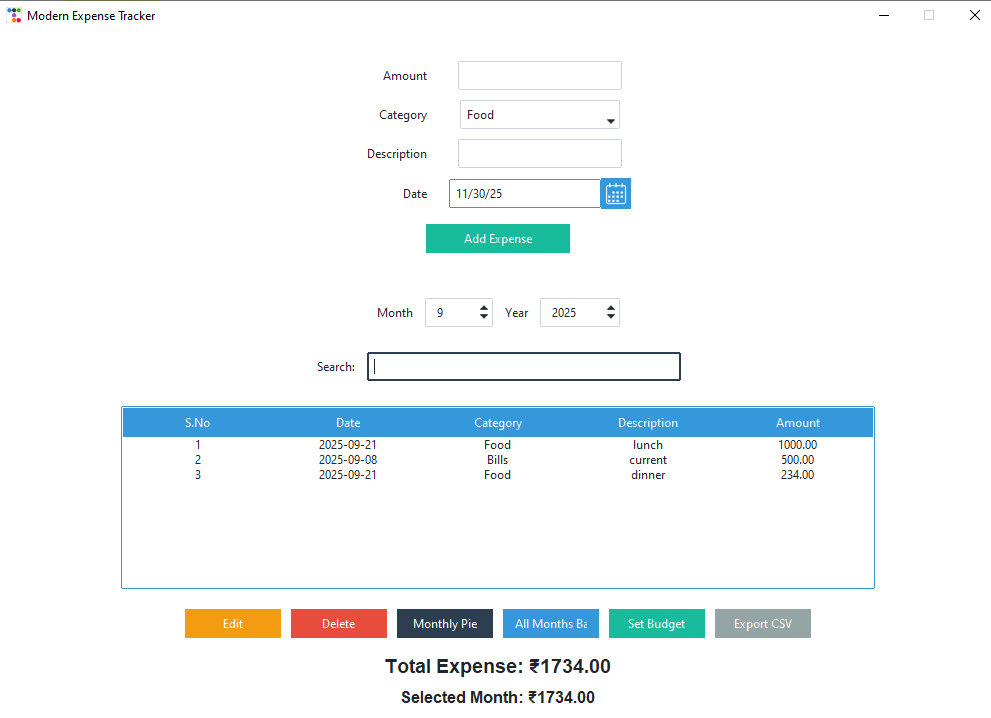
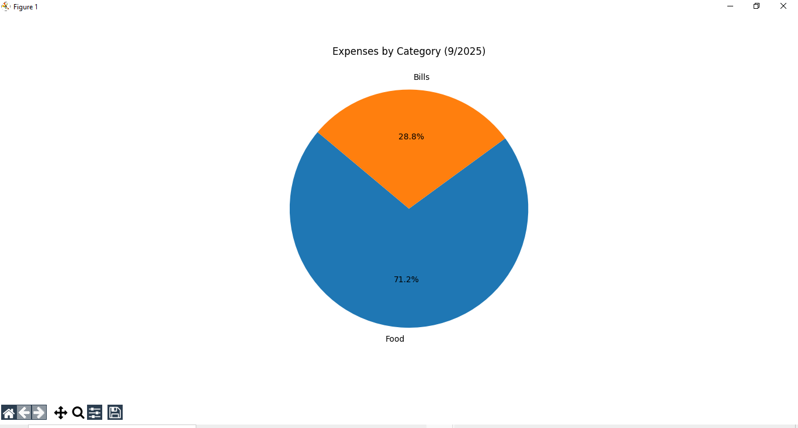
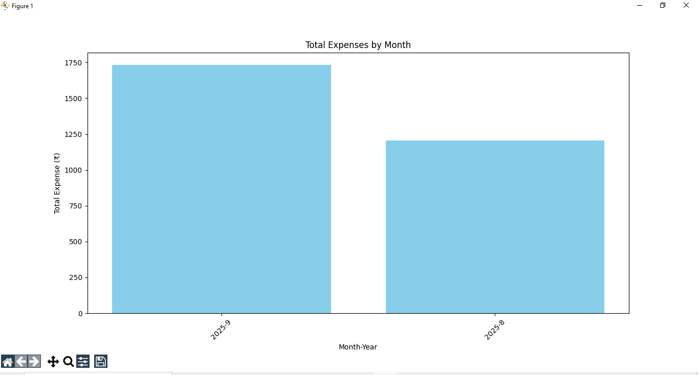
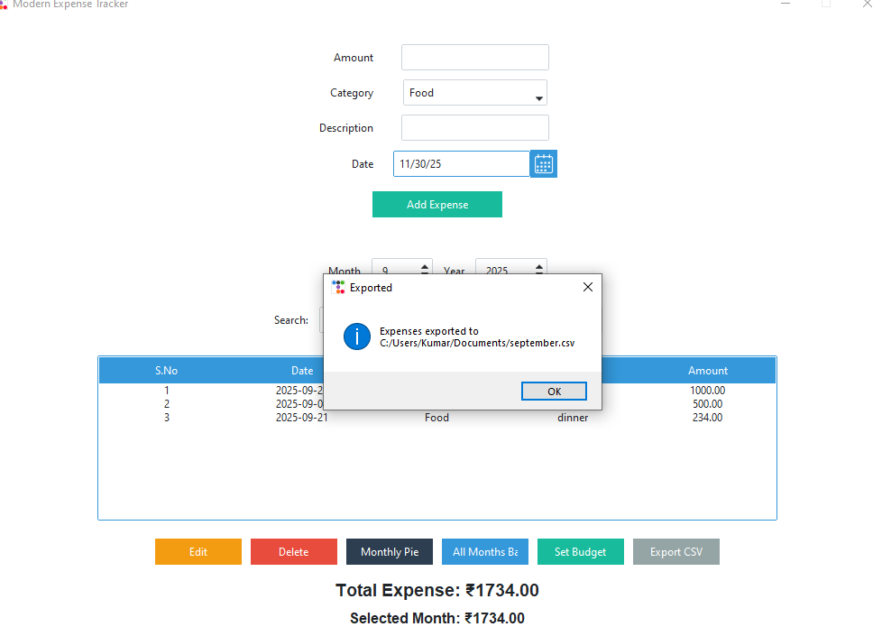

# Expense Tracker – Desktop App  

## Overview  
A modern and simple desktop application to track and manage daily expenses.  
Users can add, edit, delete, and view expenses with monthly summaries, category filters, and visual charts.  
The app also supports budgeting and CSV export, making monthly tracking faster and more organized.

## Features  
- Add, edit, and delete expenses  
- Category-wise filtering  
- Monthly total calculation  
- Pie chart (category-wise)  
- Bar chart (month-wise)  
- Budget setting with alerts  
- Export expenses to CSV  
- Persistent storage using JSON  

## Screenshots  
-Homepage

-Piechart

-Barchart

-Export CSV



## Tech Stack  
- Python 3  
- Tkinter + ttkbootstrap (GUI)  
- JSON (data storage)  
- Matplotlib (charts)  

## Installation  

1. Clone the repository:  
   ```bash
   git clone https://github.com/heman315/expense-tracker.git